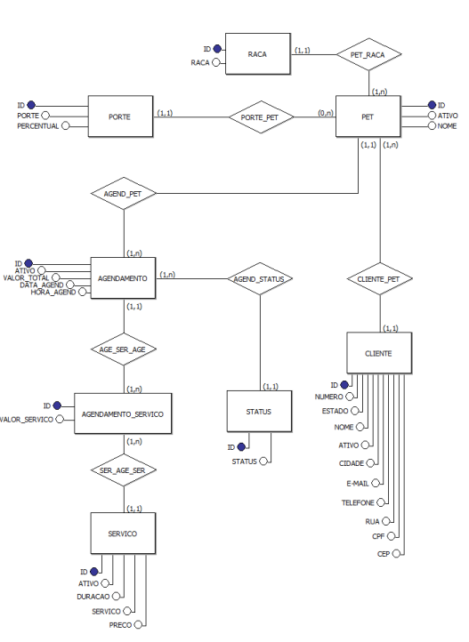

# SQL - Projeto de banco de dados Petshop
Projeto acadêmico colaborativo de banco de dados SQL desenvolvido no MySQL Workbench. Contempla o ciclo completo de dados: modelagem, criação de tabelas, povoamento e atualização. Implementa lógica avançada com Joins, Views, Procedures, Triggers e criação de Índices para otimização de consultas e automação de processos.

## Modelagem de Dados
Abaixo estão as representações visuais da estrutura do banco de dados, modeladas no [brModelo](https://www.brmodeloweb.com/).

### Modelo Entidade-Relacionamento (MER)

  

O MER foca nas regras conceituais e entidades.
 

### Diagrama Entidade-Relacionamento (DER)
| Entidade | Atributos e Relacionamentos |
| :--- | :--- |
| **RACA** | (id (PK), raca) |
| **PORTE** | (id (PK), porte, percentual) |
| **CLIENTE** | (id (PK), nome, cpf, email, telefone, rua, número, cep, cidade, estado, ativo) |
| **SERVICO** | (id (PK), servico, preco, duracao, ativo) |
| **STATUS** | (id (PK), status) |
| **PET** | (id (PK), nome, id_cliente (FK), id_porte (FK), id_raca (FK), ativo) |
| **AGENDAMENTO** | (id (PK), preco, id_pet (FK), data_agend, hora_agend, id_status(FK), ativo) |
| **AGENDAMENTO_SERVICO** | (id (PK), valor_servico, id_agendamento (FK), id_servico (FK)) |

## Tecnologias e Ferramentas
Modelagem: brModelo
Banco de Dados: SQL
IDE: MySQL Workbench

## Regras de Negócio (RN)
Para garantir a consistência dos dados, o sistema segue as seguintes diretrizes:

RN01: Atendimento exclusivo para a espécie canina.  
RN02: Fidelização: Um cliente deve possuir no mínimo 1 pet para constar no sistema.  
RN03: Propriedade: Cada pet pertence a um único cliente (relação 1:N).  
RN04: Agendamento: Cada registro de agendamento é restrito a um pet por vez.  
RN05: Composição: Um agendamento deve conter ao menos um serviço vinculado.  
RN06: O valor final do serviço é calculado multiplicando o Preço Base (PB) pelo multiplicador de porte:  

| Serviço | Preço Base (PB) |
| :--- | :--- |
| Banho e secagem | R$ 50,00 |
| Escova | R$ 40,00 |
| Limpeza dos ouvidos | R$ 30,00 |
| Corte das unhas | R$ 20,00 |
| Higiene bucal | R$ 15,00 |

| Porte | Multiplicador | Percentual |
| :--- | :--- | :--- |
| Pequeno | PB x 0.9 | 90% |
| Médio | PB x 1.0 | 100% |
| Grande | PB x 1.1 | 110% |

## Implementação Técnica
Triggers: Atualiza automaticamente o preço do serviço agendado e o preço total do agendamento.  
Procedures: Facilitam o cadastro, a exclusão lógica e a atualização de dados de pets, clientes e serviços.  
Índices: Otimização de busca por CPF de cliente e nome do pet.  
Views: Relatórios de faturamento mensal, faturamento por serviço, histórico de atendimento do pet e lista de clientes agendados para o dia.  

